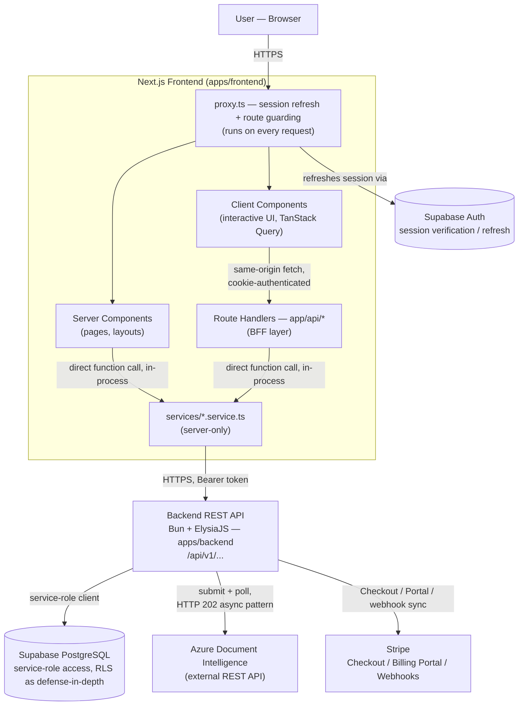
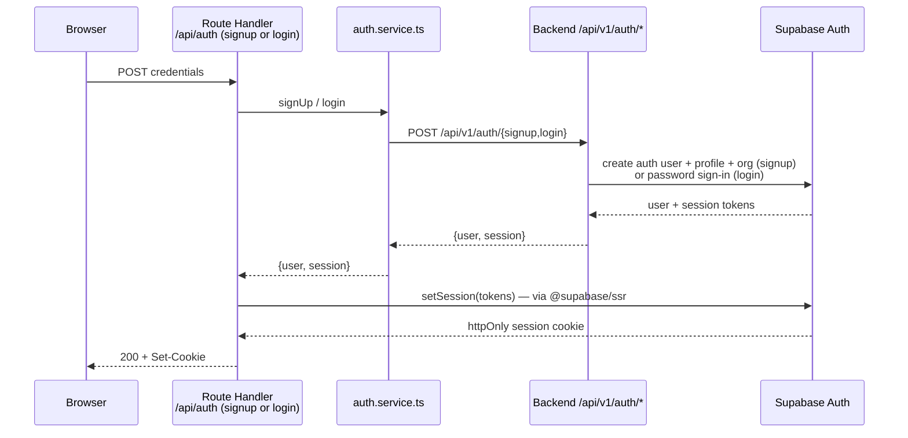
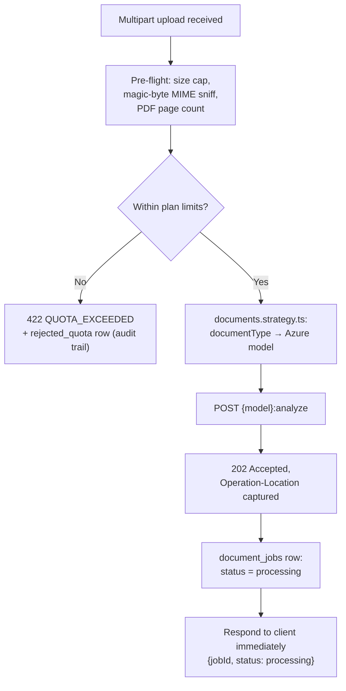
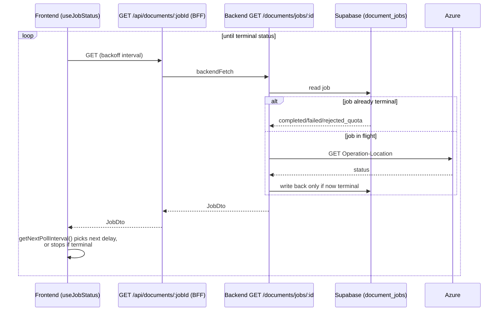

# TNDA-AI — Architecture Reference

> **Purpose of this document**: this is the canonical technical reference for TNDA-AI's architecture — what the system is, how its pieces fit together, and why it's built the way it is. It documents the architecture **as it exists today**. For the fuller Context/Decision/Consequences record behind a specific significant decision, see [`docs/adr/`](./docs/adr/). For a chronological record of how it got here (decisions, bugs found and fixed, verification performed, session-by-session progress), see [`PROGRESS.md`](./PROGRESS.md) (root, project-level) and [`apps/backend/PROGRESS.md`](./apps/backend/PROGRESS.md) / [`apps/frontend/PROGRESS.md`](./apps/frontend/PROGRESS.md) (app-level detail). This document is the distilled, current-state counterpart to that log — read this first to understand the system; read an ADR to understand one decision in depth; read `PROGRESS.md` to understand how a specific piece came to be.
>
> Last written against the repository at commit `eb49f63` (Frontend Stage 4 — Results, just completed; Stages 5-7 — History, Billing UI, Settings — not yet built).

---

## 1. System Overview

TNDA-AI is a multi-tenant SaaS platform for automated document data extraction. An organization uploads invoices, receipts, identity documents, or generic scans — as single files or `.zip` batches — and the system extracts structured data from them via Azure Document Intelligence, tracks the result against the organization's subscription plan, and presents it back through a web dashboard. Subscription billing (plan upgrades, self-service payment management, and plan-state sync) is handled through Stripe.

### Primary responsibilities

- **Ingest and validate documents** before any external processing cost is incurred: true file type (magic-byte sniffing, not a trusted `Content-Type` header), size, page count, and the organization's current plan quota are all checked pre-flight.
- **Route each document to the correct extraction model** based on its declared type (invoice, receipt, identity document, or generic), and drive Azure's asynchronous submit/poll protocol to completion.
- **Enforce multi-tenant quota and plan limits** — every organization is on a plan (free/basic/pro) with hard caps on file size, pages per document, and pages/documents per month.
- **Expose processing state and results** to clients through a versioned REST API, and present them through a web dashboard (upload, live status, extracted-field review).
- **Manage subscription billing** end-to-end: Stripe Checkout for upgrades, the Stripe Billing Portal for self-service management, and webhook-driven synchronization so the organization's plan in the database never drifts from what Stripe actually has on file.

### Main technologies

| Layer | Technology | Role |
|---|---|---|
| Backend runtime & framework | Bun + ElysiaJS | REST API — the single source of truth for business logic and data access |
| Backend validation | Zod (v3) | Every request body/query is validated via Elysia's Standard Schema integration |
| Data & auth | Supabase (PostgreSQL + Row Level Security + Supabase Auth) | Persistence, and the identity provider both apps ultimately trust |
| Document extraction | Azure Document Intelligence (REST API) | External AI service; called directly over HTTP, not through its SDK's poller |
| Billing | Stripe (Checkout, Billing Portal, Webhooks) | Subscription lifecycle |
| Frontend framework | Next.js 16 (App Router) + React 19 | Server-rendered dashboard, BFF layer, client interactivity |
| Frontend validation | Zod (v4) | Every API response is parsed at the call site, not just typed |
| Frontend server state | TanStack Query v5 | Caching, polling, mutation state — no bespoke data-fetching state |
| Frontend UI | Tailwind CSS v4 + shadcn/ui (Radix primitives) | Owned component source, one design-token system |
| Monorepo tooling | pnpm workspaces + Turborepo | Dependency management and task orchestration across both apps |

### Why the monorepo exists

The backend and frontend are two independently runnable applications that nonetheless share one thing that must never silently drift apart: the shape of the API contract between them. A monorepo keeps a contract change (a new backend field, a renamed endpoint) and its consumer (the frontend's hand-written Zod schema mirroring it) reviewable in a single commit and a single PR, without the operational overhead of publishing and version-bumping an internal npm package for what is, today, a two-application system. `packages/config` shares the one thing that actually is identical between the two apps (base TypeScript compiler settings); `packages/types` and `packages/shared` exist as wired-but-empty scaffolds, deliberately not populated until a real, concrete need to share code (not just types-in-principle) arises — see §11.

The backend's git history predates the monorepo and was preserved intact during the migration (relocated via a plain filesystem move + commit, not a history rewrite) — `apps/backend` is not a fresh application, it is the original standalone backend, moved.

### High-level architecture

The system follows a strict layering: **browser → Next.js (Server Components and a BFF layer of Route Handlers) → backend REST API → data and external services.** The frontend has no direct data-access path of its own — every piece of application data, and every call to Azure or Stripe, passes through the backend. The frontend's only direct relationship with Supabase is session/cookie lifecycle management (`@supabase/ssr`), which is authentication plumbing, not an application-data query path. See §3 for the full diagram and §5 for how specific user actions flow through these layers.

---

## 2. Architectural Principles

These are principles actually reflected in the current code — verified against source while writing this document, not asserted from memory. Each exists for a specific reason, not as a default.

| Principle | What it looks like in this codebase | Why |
|---|---|---|
| **The backend is the single source of truth for application data.** | The frontend has zero direct Supabase table queries anywhere (verified: no `.from(...)` calls exist outside `apps/backend`). Every list, stat, job status, and mutation the frontend needs is a real backend endpoint. | An earlier plan considered reading `document_jobs` directly from the frontend via Supabase RLS, since RLS already scopes reads by organization. This was deliberately reversed: a second, parallel data-access path (frontend-direct-to-Postgres alongside backend-mediated access) means query logic, filtering, and aggregation exist in two places that can drift, and the backend stops being a real API — it becomes optional. |
| **BFF (Backend-for-Frontend) layer, not a direct browser-to-backend path.** | `apps/frontend/app/api/*` — thin Route Handlers that call the same `services/*.service.ts` layer Server Components call, then return JSON. Client Components only ever call these, via a same-origin `apiFetch` helper. | The browser never holds a bearer token and never talks to the real backend origin directly. Session state stays in an httpOnly cookie; the Route Handler resolves the caller's access token server-side before forwarding the request. |
| **The frontend never queries Supabase directly for application data.** | The only Supabase usage in `apps/frontend` is `@supabase/ssr` session/cookie management (`lib/supabase/server-client.ts`, `proxy.ts`) — resolving an access token or refreshing a session, never a `.from("table")` read. | Keeps the "single source of truth" principle enforceable rather than aspirational: identity/session management is a fundamentally different concern from application data access, and the two are not allowed to blur. |
| **Strict TypeScript, and a zero-`as`/zero-`any` convention on the backend, enforced by lint, not just habit.** | Backend `tsconfig.json` extends a shared strict base (`noUncheckedIndexedAccess`, `noImplicitOverride`, `noUnusedLocals`, etc.); `@typescript-eslint/consistent-type-assertions` (`never`) and `no-explicit-any` (`error`) are hard ESLint errors in application code. The frontend shares the same strict base. | A type assertion is a place where the compiler is told to stop checking; banning it (with a narrow, explicit exception only for mocking Supabase's own deeply-generic query builder in backend tests) means a passing `typecheck` run is a much stronger correctness signal. |
| **Every API boundary is validated at runtime, not just typed at compile time.** | Backend: every route body/query is a Zod schema passed directly to Elysia as a Standard Schema validator. Frontend: every `apiFetch`/`backendFetch` call parses the response through a Zod schema (`parseApiResponse`) before the caller ever touches it. | Compile-time types describe what the code *expects*; they say nothing about what actually arrives over the wire at runtime, especially across two independently-deployed, independently-typed applications. A schema mismatch is caught at the boundary, with a structured error, not as a downstream `undefined` crash. |
| **API-first, versioned, general-purpose REST design.** | Routes are mounted under `/api/v1/...`. New backend endpoints (e.g. the document list/filter/pagination and organization-stats endpoints) are designed as stable, general-purpose contracts — parameterized filters, opaque pagination cursors, predictable response envelopes — not shaped narrowly around one frontend screen's exact needs. | The backend is meant to be a real API, reusable by any future client, not an implementation detail of this one dashboard. |
| **Incremental, test-driven frontend development.** | Since Stage 3, every frontend feature is built one slice at a time: define the type/contract, write a failing test, implement the minimum to pass it, verify the *entire* workspace (`typecheck`/`lint`/`test`) is green, then move to the next slice. | Produces many small, independently-verified increments instead of one large, harder-to-verify batch of change — and a full-workspace check after every slice catches cross-cutting regressions immediately, not at the end. |
| **Shared code is extracted after a real duplication exists, not speculatively.** | `packages/types` and `packages/shared` are scaffolded, wired into the pnpm workspace, and intentionally empty. | The backend's schemas are Zod v3 (Bun-only APIs assumed in places); the frontend's are Zod v4. Moving either into a shared package today wouldn't be a mechanical relocation — it would require reconciling two different validation-library majors first. Building that reconciliation speculatively, before anything concrete actually needs to be shared, is exactly the kind of premature abstraction this project avoids elsewhere too. |
| **Defense-in-depth tenant isolation, with one mechanism doing the real work.** | The backend talks to Postgres via the Supabase **service-role** key, which bypasses Row Level Security — every repository function filters by `organization_id` (or the caller's own id) explicitly, in application code. RLS policies exist on every table regardless, scoped the same way. | The service-role client is what actually enforces isolation for this API, in every query, verified in code review and by tests — RLS is a second, independent backstop for any future direct-from-client Supabase access, not a mechanism this API currently relies on to be correct. |
| **Centralized, structured error handling — one shape, produced in exactly one place per app.** | Backend: `error.middleware.ts`'s global `onError` normalizes every thrown `AppError` and every Elysia-native error (validation, parse, not-found) into `{error:{code,message,details?}}`. Frontend: `lib/api/route-handler.ts#toErrorResponse` does the same for every BFF Route Handler; `lib/api/response.ts#parseApiResponse` is the single place that turns a non-OK response into a typed `ApiError` on the way back in. | No endpoint hand-rolls its own error response shape. A client (this frontend, or any future one) can handle errors generically by `code`, not by inspecting per-endpoint response bodies. |
| **Progressive, staged delivery with an explicit Definition of Done per stage.** | The frontend was built stage by stage (Bootstrap → Shell+Auth → Dashboard → Upload+Processing → Results), each one fully implemented, tested, and workspace-verified before the next began — recorded in `apps/frontend/PROGRESS.md`. | Keeps each increment reviewable and each regression attributable to a small, recent change, rather than accumulating a large amount of unverified surface area before the first real check. |

---

## 3. High-Level Architecture



Notes on what this diagram deliberately does **not** show, because it doesn't exist in the current system:

- **No Supabase Storage.** Uploaded files are never persisted anywhere — they're read into memory, validated, submitted to Azure, and discarded. There is no object-storage component in this architecture today (see §8, §11).
- **No background job processing / worker / queue.** Document status advances only when something polls for it — either the frontend polling the backend, or the backend making one live call to Azure at that moment. There is no independent process advancing jobs in the background (see §7, §11).
- **The frontend's only Supabase relationship is Auth**, for session cookies — never Postgres data access. The backend is the only application component that reads or writes the database.

---

## 4. Repository Structure

```
TNDA-AI/
├── apps/
│   ├── backend/         # Bun + ElysiaJS REST API — full git history preserved from before the monorepo migration
│   └── frontend/        # Next.js 16 dashboard
├── packages/
│   ├── config/           # Shared base tsconfig.json — real, used by both apps
│   ├── types/            # Scaffolded for future shared types — empty today
│   └── shared/           # Scaffolded for future shared runtime utilities — empty today
├── .github/workflows/    # CI (typecheck/lint/test — see §10)
├── PROGRESS.md            # Project-level session log (decisions + why)
├── ARCHITECTURE.md         # This document
├── pnpm-workspace.yaml
├── turbo.json
└── package.json            # Root scripts only fan out to turbo; no application code
```

There is no top-level `docs/` directory today — documentation currently lives as `README.md` (root + per-app) and `PROGRESS.md` (root + per-app) files.

### `apps/backend/src/`

| Folder | Responsibility | Why it exists |
|---|---|---|
| `config/` | Environment validation (`env.ts`, eager Zod parse — the process refuses to boot on missing/invalid config), Supabase client construction (`supabase.ts`), Azure endpoint/key config (`azure.ts`), Stripe client + plan↔Price-ID mapping (`stripe.ts`), and a hand-written `database.types.ts` mirroring the live schema. | Every external system this app talks to (Postgres, Azure, Stripe) has its connection/credential setup centralized in one place, validated once at boot, not re-derived per call site. |
| `modules/` | One folder per bounded domain context — `auth/`, `organization/`, `billing/`, `documents/`. Each module is internally layered: `*.routes.ts` (HTTP layer) → `*.service.ts` (business logic) → `*.repository.ts` (Supabase access) → `*.schema.ts` (Zod DTOs), with `*.test.ts` files colocated next to what they test. | Keeps each domain self-contained and consistently shaped — a new contributor who understands one module's internal layering understands all four. |
| `services/` | Adapters for external systems that are **not** this app's own database — currently just `azure-document-intelligence.service.ts`, a pure REST adapter with no opinion on which Azure model to use. | Separates "how do I call Azure" (infrastructure concern) from "which model should this document use" (a domain decision, owned by `documents.strategy.ts` instead — see §7). |
| `middlewares/` | Cross-cutting HTTP concerns applied as Elysia plugins: bearer-token verification + tenant context injection (`auth.middleware.ts`), centralized error normalization (`error.middleware.ts`), and an in-memory fixed-window rate limiter keyed by client IP (`rate-limit.middleware.ts`). | These concerns apply across every module and don't belong inside any one of them. |
| `utils/` | Pure, dependency-light helpers used across modules: magic-byte MIME detection + PDF page counting (`file-inspector.ts`), in-memory `.zip` extraction (`zip.ts`), Azure per-field confidence averaging (`confidence.ts`), and the `AppError` hierarchy (`errors.ts`). | Logic with no external I/O of its own, reused by more than one module, kept trivially unit-testable. |

`apps/backend/scripts/` holds standalone operational scripts run directly via `bun run scripts/...` — a SQL migration runner (`db-migrate.ts`) and a live, real-Azure end-to-end pipeline test (`test-e2e-azure.ts`) — deliberately outside `src/`, since neither is part of the running application itself. `apps/backend/supabase/migrations/` holds ten sequentially numbered SQL files that are the database schema's authoritative history (see §8).

### `apps/frontend/`

| Folder | Responsibility | Why it exists |
|---|---|---|
| `app/(auth)/` | The unauthenticated route group — `/login`, `/signup` — with its own minimal layout (no dashboard shell). | Next.js route groups let two page trees share `app/` without sharing a layout; auth pages don't need a sidebar. |
| `app/(dashboard)/` | Every authenticated page — `/dashboard`, `/upload`, `/documents`, `/documents/[jobId]`, `/billing`, `/settings` — sharing one layout (`layout.tsx`) that renders the sidebar/topbar shell and resolves the current user once, server-side. | One shared shell, one place that gates "you must be logged in to see any of this" at the layout level. |
| `app/api/` | The BFF layer — Route Handlers that Client Components call. Thin: parse the request, call the matching `services/*` function, return JSON or a normalized error. | See §2's BFF principle — this is its concrete implementation. |
| `proxy.ts` | Next.js 16's `middleware.ts`, renamed. Runs on every request: refreshes the Supabase session and re-issues cookies (since Server Components cannot write cookies themselves), and gates access — redirects unauthenticated page views to `/login`, redirects an authenticated user away from `/login`/`/signup`, and returns a JSON `401` (not a redirect) for an unauthenticated `/api/*` call. | Centralizes session refresh and route protection in exactly one place that runs before every request, rather than scattering `getUser()` calls across every Server Component and Route Handler. |
| `components/` | `ui/` (owned shadcn/Radix primitives) plus one folder per feature area (`auth/`, `dashboard/`, `upload/`, `results/`, `layout/`, `common/`). | Presentational and composed UI, organized by the feature it belongs to, not by component "type." |
| `features/` | Client-side hooks and state per domain (`upload/`, `results/`, `auth/`) — TanStack Query hooks, a `useReducer`-based upload queue, the session-only preview cache. | The layer between raw API access (`services/`, `lib/api/`) and the components that render it — caching, polling schedules, and local state composition live here, not inside components. |
| `services/` | One `server-only` implementation per backend operation (`documents.service.ts`, `organization.service.ts`, `billing.service.ts`, `auth.service.ts`), called by both Server Components directly and by Route Handlers. | The single implementation of "how do I call the backend for X," regardless of which of the two call paths (§2) reaches it. |
| `lib/api/` | `backend-client.ts` (server-only, calls the real backend with a bearer token), `http.ts` (client-safe, same-origin `apiFetch`), `response.ts` (shared response parsing / `ApiError`), `route-handler.ts` (shared Route Handler request-parsing / error-response helpers). | The BFF boundary's actual plumbing — one HTTP helper per side of the boundary, one shared parsing/error contract for both. |
| `lib/supabase/server-client.ts` | Resolves the current request's Supabase access token, server-side only. | The one place session state is read to produce a bearer token for `backendFetch` — not duplicated per caller. |
| `lib/env.ts` | Zod-validated `process.env` access, parsed eagerly at import time — mirrors the backend's own `config/env.ts` pattern exactly. | The app refuses to boot on missing/invalid configuration, on both sides of this system, rather than failing lazily and confusingly the first time a misconfigured value is actually used. |
| `types/api.ts` | Hand-written Zod schemas (and a few type-only imports of backend types where that's mechanically possible) mirroring the backend's real wire contract, verified field-by-field against backend source. | See `docs/adr/0004-runtime-validation-with-zod.md` for the full reasoning — this is the frontend's runtime-checked model of what the backend actually returns. |
| `providers/`, `hooks/`, `test/` | A `QueryClient` provider (one per component-tree instance, not a module singleton — required under SSR), a small `use-mobile` hook, and the Vitest/Testing-Library harness (`setup.ts`, a `server-only` stub for the test environment, a shared `QueryClientProvider` test wrapper). | Standard supporting infrastructure for the App Router + React Query + component-test stack. |

### `packages/`

| Package | Contents | Status |
|---|---|---|
| `@tnda-ai/config` | `tsconfig.base.json` — strict compiler options both apps' own `tsconfig.json` extend. | Real, in active use. |
| `@tnda-ai/types` | `export {}` — a scaffold. | Empty by design (§2, §11). |
| `@tnda-ai/shared` | `export {}` — a scaffold. | Empty by design (§2, §11). |

### `.github/`

One workflow, `workflows/ci.yml`: installs the workspace, then runs `pnpm typecheck` → `pnpm lint` → `pnpm test` (each fanned out across every package by Turborepo) on every push and pull request to `master`. See §10 for what this does and does not cover.

---

## 5. Request & Data Flows

### Authentication Flow

Signup and login are **backend-orchestrated**, not a direct Supabase Auth call from the frontend — the backend creates the Supabase auth user *and* the organization/profile rows in one flow (rolling back the auth user if org/profile creation fails), which `@supabase/ssr` calling Supabase directly could not do on its own.



On every subsequent request, `proxy.ts` calls `supabase.auth.getUser()`, which transparently refreshes the session and re-issues the cookie when needed — centralized there because Server Components cannot write cookies themselves. Logout calls Supabase's real `signOut()` (server-side token revocation), not just cookie clearing.

### Upload Flow

```mermaid
sequenceDiagram
    participant U as UploadWorkspace (client)
    participant Q as useUploadQueue (reducer)
    participant C as useUploadController
    participant BFF as POST /api/documents
    participant API as Backend POST /api/v1/documents
    participant AZ as Azure Document Intelligence

    U->>Q: addFiles(...)
    Q-->>C: item status = "queued"
    C->>BFF: apiFetch (multipart)
    BFF->>API: backendFetch (multipart, bearer token)
    API->>API: pre-flight validation<br/>(size, MIME, page count, quota)
    API->>AZ: POST {model}:analyze
    AZ-->>API: 202 Accepted + Operation-Location
    API-->>BFF: 202 {jobId, status:"processing", ...}
    BFF-->>C: same response
    C->>Q: dispatch upload-succeeded
    Q-->>U: item status reflects job status; polling begins
```

`useUploadController` processes queued items **sequentially, never concurrently** (§6) — a second queued file does not begin uploading until the first has resolved. A `.zip` batch is a single multipart upload that the backend expands server-side; the frontend never uploads archive members individually.

### Document Processing Flow (backend + Azure)



Model selection (`documents.strategy.ts`) is a domain-layer decision, deliberately separated from the Azure REST adapter itself: `invoice → prebuilt-invoice`, `receipt → prebuilt-receipt`, `identity_document → prebuilt-idDocument`, `generic → prebuilt-layout`. A `.zip` batch runs this same per-file pipeline against a running, in-memory quota counter seeded from one initial database read — so many small files inside one archive can't cumulatively exceed the monthly quota even though each looks fine in isolation against the initial snapshot. One bad file in a batch never aborts the rest; each file independently resolves to `processing`/`rejected`/`rejected_quota`/`failed`.

### Polling Flow

There is no push channel and no background worker (§11). The client polls; the backend only talks to Azure again when asked to.



The poll interval backs off — 2s → 3s → 5s → 8s → capped at 10s — and stops entirely once a job reaches a terminal status. This is load-bearing, not cosmetic UX: the backend's rate limiter is IP-keyed (§7, §11), and every user's requests are proxied through the one Next.js server, so a fixed fast interval would let concurrent users exhaust a shared bucket.

### Dashboard Flow

The Dashboard is a **Server Component**, not a client-polled view — it fetches once per page load, directly, via `services/organization.service.ts`/`services/billing.service.ts` (no Route Handler hop; see §6's Server-Component call path). It renders three stat tiles (documents processed, success rate, avg. processing time — `null`, never a fabricated `0`, when there's no terminal job yet to compute from), a hand-rolled inline-SVG trend chart of the last 30 days' daily job counts (gap-filled server-side so every day in the window has an entry), and a current-plan card with usage meters. An organization with zero terminal jobs **and** zero in-flight jobs sees an empty state instead.

### Results Flow

`/documents/[jobId]` is a thin Server Component that renders a client component (`DocumentResultsView`), which drives itself entirely off the same `useJobStatus` polling hook the upload flow uses — so a results page opened immediately after upload (while the job is still `pending`/`processing`) shows live status and transitions to the extracted result automatically, with no separate "check again" action. Once `completed`, the view branches on what `resultJson` actually contains: field-shaped results (invoice/receipt/identity_document) render a name/value/confidence table; a `generic` result (no per-field structure) renders its raw extracted text instead. A preview of the originally uploaded file is shown when available — see §6 for the session-only cache this depends on, and §11 for its real lifetime limits.

---

## 6. Frontend Architecture

### App Router: Server Components by default, Client Components where interactivity requires it

Every page is a Server Component unless it needs client-side state, effects, or event handlers, in which case the interactive part is pulled into a small `"use client"` child (e.g. `app/(dashboard)/upload/page.tsx` is a trivial Server Component that renders `<UploadWorkspace />`, itself a Client Component — `metadata` exports aren't permitted in `"use client"` files, which is one concrete reason for the split, not just a style preference). Server Components that only need one point-in-time read (Dashboard, the dashboard shell's current-user fetch) call `services/*` directly, in-process — no network hop within the Next.js app itself, just a real HTTP call out to the backend. Nothing client-side re-fetches that data independently unless something concrete actually needs to (§2).

### The BFF layer and how data moves across it

Client Components never call the real backend and never hold a bearer token. They call `apiFetch(path, schema)` — a same-origin `fetch` to this app's own `/api/*` Route Handler, cookie-authenticated automatically by the browser. That Route Handler resolves the caller's access token server-side, by reading it back out of the same session cookie the browser just sent (`getAccessToken()`), and calls the same `services/*.service.ts` function a Server Component would call directly, which in turn calls `backendFetch` (server-only) to reach the real backend with a `Bearer` header built from that token. Both `apiFetch` and `backendFetch` route their response through the same `parseApiResponse` — a non-OK response becomes a typed `ApiError` (status + machine `code` + message), a 2xx response is parsed through the caller's Zod schema before it's trusted.

### Server state: TanStack Query, no bespoke fetching state

Every piece of server-derived state a Client Component needs — job status, the upload mutation itself — goes through TanStack Query (`useQuery`/`useMutation`), configured with a 30s `staleTime` and a single retry by default. `useJobStatus(jobId)` is the one hook that drives all live polling; its `refetchInterval` is computed by a pure, separately-tested backoff function (`getNextPollInterval`) rather than logic embedded in the query call itself — keeping the actually-tricky part (the schedule, and when to stop) trivial to unit-test with no timers or rendering involved.

### Local reducer state: the upload queue

Client-side upload progress (a file queued, uploading, processing, completed/failed — states that only exist transiently on the client, before or alongside a real backend job) is modeled as a `useReducer`-driven queue (`features/upload/queue.ts`), deliberately decoupled from the hooks that actually talk to the backend. A separate controller hook (`use-upload-controller.ts`) composes the queue with `useUploadDocument`/`useJobStatus`: it drives queued items through the upload mutation **sequentially** (an `isUploadingRef`, not state, guards against a second upload starting before the first settles) and dispatches queue transitions from the mutation's own callbacks. The reducer has no import of either network-facing hook — it only knows how to represent and transition queue items, which keeps it testable with plain objects and no network mocking.

One correctness rule this reducer specifically enforces: any action driven by a repeating/polling effect (as opposed to a one-shot event) must return the **exact same state reference** when nothing meaningfully changed. `useReducer`'s only re-render bail-out is reference equality — an action that fires repeatedly with frequently-identical data will otherwise produce a "new" state every time regardless, which becomes a real infinite-update-loop risk the moment anything downstream (an unstable callback, an effect keyed on the resulting value) reacts to that reference change. (This is not a hypothetical: a real "Maximum update depth exceeded" crash was found, root-caused, and fixed this way — see `PROGRESS.md` §3.11/§4 decision 25.)

### Polling strategy

Covered in full in §5 — the schedule backs off (2s/3s/5s/8s, capped 10s) and stops on any terminal status, and this is a load-bearing choice given the backend's IP-keyed rate limiter (§7, §11), not just UX polish.

### Preview cache

`features/results/preview-cache.ts` is a plain **module-level** `Map<jobId, File>` — deliberately not React state, not a Context, not persisted anywhere. It exists to solve one specific problem: the Results page is a different route from the upload page, so the just-uploaded `File` object (only ever held in the upload queue's local state) would otherwise be unreachable after a client-side navigation to `/documents/[jobId]`. A plain module `Map` survives that client-side navigation (the module isn't re-evaluated) but disappears on a real page reload — which is the intended scope: this is a session-only, best-effort preview, not persisted storage (§8, §11). `useDocumentPreview(jobId)` reads this cache, creates a `blob:` URL via `URL.createObjectURL` when a file is present, and revokes it on unmount or when `jobId` changes. The type this backs, `DocumentPreviewSource` (`session-blob | remote-url | unavailable`), is a deliberately swappable union — `remote-url` has no producer today (the backend never persists files) but exists so a persistent, backend-provided URL could replace the session-only source later without touching any UI component that consumes it.

### Component and feature organization

`components/` is organized by feature area (`upload/`, `results/`, `dashboard/`, `auth/`, `layout/`), plus `ui/` for owned shadcn/Radix primitives shared across all of them. `features/` holds the hooks and state each domain needs — the boundary is: `components/` renders, `features/` (plus `services/`) fetches/holds/derives. Presentational components (e.g. `DocumentFieldsTable`, `UploadQueueItemRow`) take plain props and render nothing else; composition components (e.g. `DocumentResultsView`, `UploadWorkspace`) are the ones that call hooks and wire pieces together.

---

## 7. Backend Architecture

### Layered architecture

Every domain module (`auth`, `organization`, `billing`, `documents`) follows the same internal layering:

```
*.routes.ts       HTTP layer — Elysia route definitions, Zod body/query validation, calls into the service layer
      ↓
*.service.ts      Business logic — orchestration, validation rules, calls into the repository layer
      ↓
*.repository.ts   Supabase access — the only layer that talks to supabaseAdmin directly
      ↓
*.schema.ts       Zod DTOs — request/response shapes for this module
```

There is no separate "controller" layer distinct from routes — in this Elysia-based codebase, `*.routes.ts` **is** the controller layer: it owns request parsing/validation wiring and delegates immediately to the service layer, with no business logic of its own. All first-party imports use an absolute `@/*` alias (mapped to `src/*`) rather than relative paths.

### Routes and request composition

`src/index.ts` is the single composition root: a global `errorMiddleware`, then `cors`, then Swagger (mounted at `/docs`), then the global rate limiter, then `/health`, then the four route modules mounted in sequence. Authentication is **not** global — `authMiddleware` is applied per route group (`.use(authMiddleware)`), which is what lets `billing.routes.ts` register its public Stripe webhook endpoint *before* that `.use()` call, so it's reachable with no bearer token while every other billing route still requires one.

### Services

Each module's `*.service.ts` holds the actual business rules: `documents.service.ts` runs the pre-flight validation pipeline and orchestrates single-file vs. `.zip`-batch submission; `organization.service.ts` resolves an org's "effective plan" (its active subscription, or the implicit free tier) and computes usage/stats; `billing.service.ts` owns Stripe Checkout/Portal session creation and the webhook → `subscriptions` sync. `src/services/azure-document-intelligence.service.ts` is architecturally distinct from a module service — it's an **external-system adapter**, not a domain service: it knows how to call Azure's REST API (submit, poll, retry on `429` with backoff+jitter) and takes the model id as a parameter, with zero opinion on which model any given document should use.

### Repositories

Every repository function goes through `supabaseAdmin`, the **service-role** client — which bypasses Row Level Security entirely — and every query explicitly filters by `organization_id` (or the caller's own identity) in application code. This is the mechanism that actually enforces multi-tenant isolation for this API (§2); RLS policies exist on the same tables as an independent second layer, relevant if this database is ever queried by something other than this trusted server context.

### DTOs and validation

Every request body, query-string, and response shape that matters is a named Zod schema in the owning module's `*.schema.ts` (or, for cross-cutting shapes, `src/utils`/`src/config`). Elysia's Standard Schema support means these are passed directly as route validators — there is no parallel TypeBox schema layer duplicating what Zod already describes.

### Authentication

`auth.middleware.ts` extracts a `Bearer` token, verifies it against Supabase (`supabaseAdmin.auth.getUser(token)`), loads the caller's `profiles` row, and injects a typed `AuthContext` (`{userId, email, organizationId, role}`) into the route context via Elysia's `.derive()`. Every protected route reads tenant/user identity from this context — none re-derives it. Password sign-in (`auth.repository.ts`) deliberately uses a **fresh, one-off** Supabase client per call, never the shared `supabaseAdmin` singleton — `supabase-js` mutates a client's internal session on a successful sign-in, and doing that on a shared, process-wide singleton would silently downgrade every subsequent request handled by that process from `service_role` to whichever user last signed in. (This was a real, previously-shipped bug — see `apps/backend/PROGRESS.md` §8 — fixed by introducing `createAuthClient()` for this one call path.)

### Error handling

A single global `onError` handler (`error.middleware.ts`) normalizes three kinds of failure into one response shape: the app's own `AppError` subclasses (each carrying an HTTP status and a stable machine `code`), Elysia's own native errors (`VALIDATION`, `NOT_FOUND`, `PARSE`), and any other unhandled exception (logged server-side, returned as a generic `500 INTERNAL_ERROR` in production — the real message only in non-production environments).

### Database access

Exclusively through `supabaseAdmin` in repository functions — no module outside `*.repository.ts` files constructs a query. Aggregation (usage totals, stats, gap-filled daily series) is pushed into Postgres functions rather than pulled into the app and summed client-side; see §8.

### Background processing

**There is none.** This is a real, current architectural characteristic, not a gap glossed over: `GET /documents/jobs/:id` is the only thing that ever advances a job past `pending`/`processing`, and it does so **synchronously, inside that request's handler**, only when called. If nothing ever polls a job again, it never resolves. See §11 for the operational implication.

### Azure integration

Covered in detail in §5's Document Processing Flow. Two things worth restating architecturally: (1) the Azure REST API is called directly via `fetch`, not through `@azure/ai-form-recognizer`'s SDK poller, because this backend persists the `Operation-Location` and resumes polling from a **separate, later HTTP request** (possibly a different server instance) — a shape the SDK's in-process poller isn't designed for; (2) model selection is entirely owned by `documents.strategy.ts` (a domain-layer registry), not the Azure adapter itself or any global config — adding a document type, repointing one at a different Azure model, or (in principle) swapping to a different provider for one type touches exactly one file.

---

## 8. Data Persistence

### Supabase: database and auth, no storage

Supabase provides two things to this system: **PostgreSQL** (the only database) and **Supabase Auth** (the only identity provider, used by both apps — the backend for orchestration/verification, the frontend only for session/cookie lifecycle). **Supabase Storage is not used anywhere in this system.** Uploaded files are read into memory, validated, submitted to Azure, and never written to disk or any object store — this is a deliberate, load-bearing architectural fact (it's the reason the frontend's document preview is session-only, §6, §11), not an oversight.

### Migrations

Ten sequentially numbered SQL files in `apps/backend/supabase/migrations/`, the schema's authoritative history:

| # | Adds |
|---|---|
| `0001` | `pgcrypto` extension (`gen_random_uuid()`) |
| `0002` | `organizations` table |
| `0003` | `profiles` table (`owner`/`admin`/`member` role enum, FK to `auth.users`) |
| `0004` | `current_organization_id()` helper + RLS policies for `organizations`/`profiles` — split out from `0002`/`0003` because a `LANGUAGE SQL` function's body is validated against the catalog at `CREATE FUNCTION` time, so it must be defined after the tables it queries exist |
| `0005` | `plans` catalog, seeded (`free`/`basic`/`pro`) |
| `0006` | `subscriptions` — one active/trialing/past_due row per org, enforced via a partial unique index |
| `0007` | `document_jobs` + its status enum (`pending/processing/completed/failed/rejected_quota`) + an `updated_at` trigger |
| `0008` | `get_organization_monthly_usage(org_id)` — the pre-flight quota-check function |
| `0009` | `organizations.stripe_customer_id`, `subscriptions.stripe_customer_id`/`stripe_subscription_id` (the latter a **plain**, non-partial unique index — required for Stripe webhook upserts, which target `ON CONFLICT` with no `WHERE` clause) |
| `0010` | `get_organization_job_stats`/`get_organization_daily_job_counts` — analytics functions backing the Dashboard's stats and trend chart |

Applied via either this project's own transactional migration runner (`bun run db:migrate`, tracked in a `public._migrations` table) or the Supabase CLI (`bun run db:push`, tracked separately) — the two are not interoperable against the same database.

### Row Level Security

Every table has `organization_id`-scoped `select` policies (and a same-org `insert` policy on `document_jobs`); writes beyond that are service-role only. As established in §2/§7, this is defense-in-depth — the backend's own explicit `organization_id` filtering in every repository query is what actually enforces isolation for this API today, since the service-role client bypasses RLS entirely.

### Cursor (keyset) pagination

`GET /documents` paginates on `created_at` alone via an opaque, base64url-encoded cursor — not offset (`.range()`) pagination, and not a compound `(created_at, id)` cursor. Offset pagination drifts under concurrent inserts (a real case here: a `.zip` batch upload can add many rows while someone is paging through their own history). A compound cursor would require interpolating decoded, client-supplied content into a Supabase filter *expression* via `.or()`, rather than passing it as a filter *value* — judged a worse trade than the accepted one (two jobs created in the exact same instant could theoretically land on opposite sides of one page boundary; rare, since each row is written by a separate awaited round trip). A malformed or tampered cursor is treated as "first page," never a request error.

### Document metadata

`document_jobs` carries `document_type` (which Azure model was used) and `average_confidence` (computed once, at completion, from Azure's own per-field confidence scores — `null`, never a fabricated `0`, for `generic`/`prebuilt-layout` results, which have no per-field confidence at all) as persisted columns, alongside the raw `result_json` Azure returned. `result_json` is genuinely heterogeneous by design — its shape depends entirely on which Azure model processed the document (see §11) — and is stored as-is, not reshaped or normalized into a common structure server-side.

### PostgreSQL functions

Aggregation is pushed into the database rather than pulled into the app and summed: `get_organization_monthly_usage` (the pre-flight quota check), `get_organization_job_stats` and `get_organization_daily_job_counts` (Dashboard analytics). The daily-count series a Postgres `GROUP BY` produces is naturally **sparse** (only days with activity); gap-filling it into a complete, contiguous date range happens once, in the service layer, so every consumer of that data gets a chart-ready series without needing to know the query returns gaps.

---

## 9. Testing Strategy

### Backend

Vitest, run via Bun — 94 tests across 12 files. Route-level tests run fully in-process via Elysia's `app.handle(request)` (the real routes, the real error middleware, no port ever bound); repository tests mock `supabaseAdmin` with a minimal fake of Supabase's fluent query builder, covering both the success and `AppError`-on-failure path for every exported function; Stripe webhook signature verification is tested for real, with zero network calls, by signing a plain JS payload locally with `stripe.webhooks.generateTestHeaderStringAsync()` and handing it to the actual verification code. None of it needs real Supabase/Azure/Stripe credentials — `vitest.config.ts` supplies dummy, non-secret env values that satisfy `env.ts`'s eager Zod validation.

### Frontend

Vitest + Testing Library + jsdom — 140 tests across 23 files, built entirely under the TDD workflow described in §2 since Stage 3. Two environment-specific patterns exist because the stack genuinely requires them, not by accident: Route Handler tests that construct a `FormData`/`File` run under `@vitest-environment node` (jsdom's own `File`/`FormData` fail undici's native `Request.formData()` brand check — and Route Handlers are server code regardless, so this is also the semantically correct environment); tests that need real timer control over a polling interval use a small local `advanceUntil` helper, since Testing-Library's `waitFor` polls via a real `setInterval` that never fires while Vitest's fake timers are frozen.

### Typecheck, lint, and Turbo verification

`pnpm typecheck` / `pnpm lint` / `pnpm test`, run from the repository root, fan out across all five workspace packages via Turborepo's task graph (with caching — an unchanged package's checks replay from cache rather than re-running). This is the standard verification unit referenced throughout this project's history as "full workspace verification": all three, clean, across every package, not just the package that changed.

### Manual browser verification

No browser automation tool is available in the development environment this project has been built in — every stage's interactive behavior (drag-and-drop, live polling, actual rendering) has ultimately needed either a real end-to-end `curl`-based check against the real backend and Supabase project, or the project owner manually exercising the running app in their own browser. This is not a stopgap being tolerated indefinitely — it has already caught one real production bug (a client-side infinite re-render loop, `PROGRESS.md` §3.11) that no automated test in this stack was able to reproduce, despite deliberate attempts. Manual browser verification is treated as a required, distinct step for any frontend work with real interactive/rendering risk, not an optional nice-to-have on top of automated tests.

### Definition of Done

Synthesized from the pattern this project has followed consistently: a unit of work is done when (1) the specific tests written for it pass, (2) a full workspace `typecheck`/`lint`/`test` run is clean, and (3), for frontend work with real interactive or rendering behavior, it has been exercised manually (in a real browser, or failing that, via a real HTTP round trip against the real backend) — with any gap in that manual verification explicitly stated, never silently assumed passing.

---

## 10. CI/CD & Deployment

### pnpm workspace + Turborepo

`pnpm-workspace.yaml` declares `apps/*` and `packages/*` as workspace members. `turbo.json` defines four cacheable tasks (`build`, `typecheck`, `lint`, `test`) plus a non-cached, persistent `dev` task; the root `package.json`'s scripts are one-line delegations to `turbo run <task>` — no application code lives at the repository root.

### GitHub Actions

One workflow, `.github/workflows/ci.yml`, triggered on every push and pull request to `master` (this repository's actual default branch). It sets up pnpm + Node 22 (Node is needed for pnpm and the frontend's build tooling) and Bun 1.3.14 (what the backend's own scripts actually execute under), installs with a frozen lockfile, then runs `pnpm typecheck` → `pnpm lint` → `pnpm test`. No GitHub Secrets are required — the backend's test suite runs entirely on dummy, non-secret environment values.

### Docker

A production image exists for the **backend only** — there is no Dockerfile, and no equivalent containerization, for the frontend today. `apps/backend/Dockerfile` is a five-stage build (`base` → `install` → `test` → `install-prod` → `release`) on a version-pinned `oven/bun` Alpine base:

- The build **context is the monorepo root**, not `apps/backend/` — a pnpm workspace needs its root lockfile and every member's `package.json` to resolve the dependency graph, even though `--filter=@tnda-ai/backend...` scopes the actual install to just this package's own dependency chain. The corresponding `.dockerignore` lives at the repository root for the same reason.
- The `test` stage is a genuine **build-time gate**: `typecheck`/`lint`/`test` must all pass or the image cannot be built at all. Test files are deliberately kept in the build context (excluding them would leave the test runner with nothing to run, silently defeating the gate) and are deleted from that stage's filesystem immediately after the run, before the final `release` stage copies source from it — so they exist long enough to matter but never reach the runtime image.
- The final image runs as the base image's pre-created, unprivileged `bun` user, and exposes a `HEALTHCHECK` against the real `/health` endpoint.

### Build pipeline and deployment assumptions

`pnpm build` produces a production build for the frontend (`next build`); the backend has no separate build step and runs directly from source via `bun src/index.ts` (inside the Docker image, or directly via `bun run start`). There is no deployment platform configuration anywhere in this repository — no Vercel project config, no Fly/Render/Railway/Kubernetes manifests, and CI does not build, tag, or push the Docker image to any registry. Deployment today is a manual, out-of-band step.

### Current limitations

- CI verifies correctness (typecheck/lint/test) but never builds the Docker image — a Dockerfile-breaking change would only be caught by whoever next runs `docker build` locally, not by CI.
- No CD pipeline exists in any form; there is no automated path from a merged commit to a running deployment.
- The frontend has no containerization story at all yet.
- The backend's in-memory rate limiter (§7, §11) implicitly assumes a single running instance — nothing in the current deployment tooling addresses horizontal scaling.

---

## 11. Known Architectural Constraints

- **`result_json` is genuinely heterogeneous, by design, not by oversight.** Its shape depends entirely on which Azure model processed the document: `invoice`/`receipt`/`identity_document` results have a `documents[].fields{name:{confidence,...}}` structure; `generic` (`prebuilt-layout`) results have none of that — only `{pages, tables, content}`. Every piece of code that reads this field (the backend's confidence averaging, the frontend's field-extraction logic) is written defensively against this — narrow, non-throwing, degrade-to-empty on anything unexpected — rather than assuming one canonical shape.
- **Uploads are processed strictly sequentially on the client, never concurrently**, even when multiple files are queued at once. This mirrors the same rate-limiting caution that drives the polling backoff schedule: a burst of simultaneous upload requests from the one Next.js server proxying every user is the same category of risk as a burst of poll requests.
- **The document preview cache is session-only and lives for exactly one browser tab's page lifetime.** It is a plain module-level `Map`, not persisted state — it survives a client-side route change but not a real page reload, and it holds nothing at all for any job reached outside the immediate upload→results flow (a reloaded results page, a job opened from a future History list). This is a direct, unavoidable consequence of the "no file storage" constraint below, not an independent limitation.
- **No uploaded file is ever persisted anywhere.** There is no object storage in this system (§8) — a document exists as bytes in memory for exactly as long as one request/processing cycle needs it. A "view the original file again later" feature, for any job beyond the immediate post-upload flow, is not achievable without adding real storage infrastructure first.
- **The job-status polling strategy is a real, load-bearing mitigation for a real backend limitation**, not just UX polish: the backend's rate limiter is a single, IP-keyed, in-memory fixed window (§7) — and because every user's traffic is proxied through the one Next.js server, it becomes a bucket effectively shared across *all* users of the app, not per-user. Backoff manages this; it does not fix it. The actual fix (keying the limiter on authenticated user identity instead of IP, and/or a shared store instead of an in-memory `Map`) is a backend change, out of scope for anything the frontend alone can do.
- **`packages/types` and `packages/shared` are intentionally empty** (§2). The two apps' schema layers are on different major versions of the same validation library (Zod v3 backend, Zod v4 frontend) for reasons independent of this monorepo, and backend code assumes Bun-only APIs in places — real sharing is a deliberate future decision, not a mechanical relocation waiting to happen.
- **There is no background job processing anywhere in this system** (§7). A document job only ever advances when something polls `GET /documents/jobs/:id` — the frontend while a user has that job's status visible, or (in principle) any other authenticated caller. A job nobody ever polls again simply never resolves past `pending`/`processing`, even though Azure itself finished processing it. This is a real production limitation for any workflow where a client might disconnect before a job completes, not a hypothetical edge case.
- **Rate limiting and the future need for horizontal scaling are already in tension.** The limiter's in-memory `Map` is correct only for a single running backend instance; scaling to more than one process/instance without first moving it to a shared store (e.g. Redis) would make each instance enforce its own independent limit, silently multiplying the effective ceiling.
- **A `.zip` batch has exactly one `documentType` for the entire archive.** There is no per-file document-type detection or override within a single batch upload.
- **No team/role-management capability exists**, despite `profiles.role` (`owner`/`admin`/`member`) already existing in the schema and in RLS policies. There is no invite-a-teammate or change-a-role endpoint anywhere in the backend today.
- **The frontend's billing capability is currently read-only.** The backend fully implements Checkout, the Billing Portal, and webhook-driven subscription sync (§7) — but the frontend only calls the read-only `GET /billing/subscription` today; `plans`/`checkout`/`portal` have no frontend service or BFF route yet.
- **The Docker image has been built and run successfully outside of automated CI** (confirmed once, historically, by the project owner on their own machine — `apps/backend/PROGRESS.md` §11) but is not build-verified by any automated process today (§10) — a regression here would not be caught until someone builds it by hand again.
- **No idempotency/replay protection beyond Stripe's own signature and timestamp check.** The webhook handler doesn't record processed event IDs, so a Stripe redelivery of an already-handled event gets reprocessed. Currently harmless, since the sync operation is a pure upsert keyed by `stripe_subscription_id` — reprocessing just re-writes the same values — but would matter the moment any future webhook handler does something non-idempotent (e.g., sends an email per event).

---

## 12. Future Documentation Roadmap

**Done since this document was first written**: [`docs/adr/`](./docs/adr/) now holds 10 numbered Architecture Decision Records covering the most significant decisions referenced throughout this document — start there for the fuller Context/Decision/Consequences treatment of anything marked with a decision reference above. The list below is what's still genuinely missing, intentionally not created as part of this pass:

- **More ADRs.** Ten cover the highest-priority decisions; `PROGRESS.md`'s root §4 (29 numbered decisions total, each already stating its own reasoning) remains the source list for any not yet written up formally.
- **Formal sequence diagrams** for flows not yet covered at that level of detail — in particular the full Stripe webhook → subscription-sync state machine, and the pre-flight quota-check decision tree for `.zip` batches.
- **Database schema documentation** — an entity-relationship diagram and a per-table reference (columns, constraints, RLS policies, which Postgres functions read/write each table), distinct from the raw migration files themselves.
- **A formal API reference.** Swagger/OpenAPI UI is already live at the backend's own `/docs` endpoint, generated from the real route definitions — but there is no static, versioned API reference document alongside this repository's own documentation.
- **A deployment runbook** — this document deliberately stops at "no deployment configuration exists yet" (§10); the actual runbook (target platform, environment variable provisioning, secrets management, rollback procedure) is future work once a real deployment target is chosen.
- **A monitoring/observability guide** — this system currently has no structured logging, metrics, or alerting strategy documented anywhere; today's error visibility is `console.error` plus whatever a hosting platform's own request logs capture.
- **An onboarding guide** distinct from this document — this file explains the architecture; a separate onboarding path (environment setup order, which credentials are needed for what, a suggested first-week reading order across `README.md`/`PROGRESS.md`/this file) does not exist yet.
