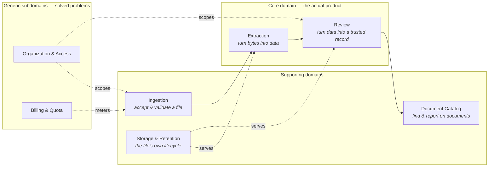
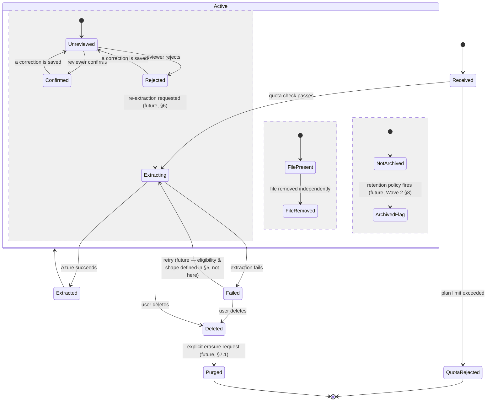

# The Document Domain — Architecture & Roadmap

**Status**: Proposed, reviewed 2026-08-07. The core direction — bounded contexts, orthogonal axes, the wave sequencing — is confirmed as the basis for future work. Nothing in this document is implemented by writing or reviewing it: no schema, code, or dependency changes were made as part of this revision. **Wave 2 (§8) shipped 2026-08-08** — the lifecycle event log and retry-state schema described in §4.1/§3.2 are now real; see the "done" notes inline in §3.2, §4.1, and §8, and `docs/adr/0011-lifecycle-event-log-and-retry-state.md`. Waves 3-6 remain proposals only.
**Companion to**: [`ARCHITECTURE.md`](../ARCHITECTURE.md) (current-state reference), [`docs/adr/`](./adr/) (individual accepted decisions), [`PROGRESS.md`](../PROGRESS.md) (session-by-session history).
**Audience**: whoever picks up backend/frontend work on documents next — this session or ten sessions from now.

---

## How to use this document

`ARCHITECTURE.md` answers "what does the system look like today, and why." This document answers a different question: "where is the *document domain* — the part of this system that takes a file in and produces a reviewed, trusted record out — going, and in what order should it get there."

It is scoped deliberately narrower than the whole system. Auth, billing, and the dashboard get mentioned only where they touch a document's lifecycle directly. Everything here is about one thing: **the life of a document, from the moment a user drops a file to the moment that record is no longer this system's responsibility.**

Three things this document is *not*:
- Not a replacement for `ARCHITECTURE.md`. When they disagree on current state, `ARCHITECTURE.md` is right (or needs fixing) — this document is about future state.
- Not a commitment to build everything here. Section 8 is a *proposed* sequence; Section 9 names the decisions that aren't purely technical and need a real product call before the corresponding roadmap item starts.
- Not permanent. This should be revised as waves complete — treat stale sections here the same way `PROGRESS.md` already treats its own staleness: flag it, don't silently work around it.

**A labeling convention, added on review:** every non-trivial proposal below is tagged as one of three kinds, because conflating them is exactly how a document like this quietly starts making decisions it has no authority to make:
- **Architecture decision** — resolved here, now, because resolving shapes, boundaries, and invariants is this document's job. Building it is still future work; the *decision* is not.
- **Future capability** — something this design makes possible or easier later, not a commitment that it will be built, and not yet designed in enough detail to build.
- **Product decision** — deliberately not decided here. The full list is §9.

---

## 1. The document domain today, in one paragraph

A user uploads a file (or a `.zip` of files) as one of four types — invoice, receipt, identity document, or generic. The backend validates it against plan limits, persists the original to Supabase Storage, and submits it to Azure Document Intelligence. Azure's result — structured fields for the three named types, Markdown text for generic — lands on the job row the moment a client happens to poll for it; there is no background process advancing anything on its own. Once complete, a human can edit any extracted field (every edit is permanently logged, never overwritten), then confirm or reject the extraction. The original file can be removed independently of the record, or the whole record can be soft-deleted — hidden everywhere, never actually erased. That's the entire lifecycle that exists today. It was built in three deliberate phases this session and is now feature-complete for that scope.

Everything below starts from that real, working system — not a rewrite of it.

---

## 2. Bounded contexts

The document domain is not one thing; it's several adjacent concerns that currently share one table (`document_jobs`) because sharing a table was the right call at this scale. As the system grows, these are the seams worth keeping in mind — not necessarily separate services or even separate tables yet, but separate *areas of change*, each with its own reason to evolve independently of the others.

**Extraction** and **Review** are the *core domain* — the reason this product exists is "AI extraction with reliable human oversight," not "file storage" or "a document list." Investment here compounds; this is where a real competitive edge would come from (auto-confirm rules, extraction quality, reviewer ergonomics), and it's the right place to spend disproportionate design effort.

**Ingestion**, **Storage & Retention**, and **Document Catalog** are *supporting domains* — necessary, real, but not differentiators. They should be solid and boring, not creative.

**Organization & Access** and **Billing & Quota** are *generic subdomains* the document domain depends on but doesn't own. They already exist as their own modules (`organization.service.ts`, `billing.service.ts`) and should stay that way — nothing here proposes folding them in.

### Why this decomposition, concretely

- **Ingestion vs. Extraction**: today these are back-to-back function calls in `processSingleDocument`. They're already conceptually separate — quota/format validation has nothing to do with which AI provider does the extracting — and Wave 3 (§8) is exactly the point where that separation has to become real (a queue sits between them).
- **Extraction vs. Review**: separated by an actor, not just a data shape. Extraction is the system acting; Review is a human acting on what the system produced. The natural home for "auto-confirm high-confidence results" (§6) is precisely the boundary between these two — a rule that decides whether a document *needs* a human at all.
- **Storage & Retention as its own thing, not part of Extraction**: the original file and the extracted data already have independently-varying lifecycles today (Phase 2 built exactly this — remove the file, keep everything else). That's not an implementation detail, it's the domain telling you something: the file is evidence, the extraction is the asset. They should keep being managed separately.
- **Document Catalog as a future read-side concern**: today, "find a document" and "record a document" both hit the same table with the same query shape. That's fine now. It stops being fine exactly at the point §8's Wave 5 describes — once a single org's history is large enough that list/search queries have different performance needs than the write path. Naming the seam now means noticing that point when it arrives, instead of after it's already a production complaint.

### What this decomposition does *not* imply

Naming these as seams is a reasoning tool, not a proposal to split anything out physically. **Architecture decision**: the document domain stays inside the existing modular backend — one deployable, `documents.service.ts`/`documents.repository.ts`/`documents.routes.ts` organized by module exactly the way they already are — and every proposal below assumes that. No microservices, no CQRS, and no event sourcing are introduced anywhere in this document *unless a concrete, current requirement forces it*; "it would be cleaner" is not that bar. Concretely: §5's background-processing contract calls for a job queue because synchronous Azure polling on the request path is a real, present problem — not because a queue is generally good practice, and even that queue is proposed as Postgres-backed, reusing an already-present dependency rather than adding a new one. If a future bounded context genuinely needs to scale or deploy independently, that's a decision to make explicitly, with a stated reason, when it's actually true — not a default this document is quietly steering toward.

---

## 3. The complete document lifecycle

### 3.1 What exists today (the foundation, not a strawman)

Three independent axes, deliberately kept orthogonal (this was the right call in Phase 1 and this document doesn't propose collapsing it):

| Axis | Values | Meaning |
|---|---|---|
| **Processing** | `pending → processing → completed \| failed \| rejected_quota` | Did Azure produce a result? |
| **Review** | `unreviewed → confirmed \| rejected` (only meaningful once processing = `completed`) | Did a human sign off on it? |
| **Retention** | `active → deleted` (file presence is a fourth, semi-independent flag: `storage_path` set or null) | Is the record — and its file — still here? |

This is a genuinely good foundation: each axis changes for a different reason, at a different rate, triggered by a different actor. The proposal below keeps that shape and extends it, rather than replacing it.

Worth making explicit, because §3.2 builds directly on it: **Retention today is not a stored enum at all** — `active` vs. `deleted` is read off whether `document_jobs.deleted_at` is null, a nullable-timestamp shape, not a state column. That's a real, working precedent for representing a retention value as an attribute rather than inventing a new state, and it's the model §3.2's resolution extends rather than departs from.

### 3.2 What's missing, and why it's worth adding

**On the Processing axis**: `failed` today has no distinction between *retryable* (Azure had a transient 5xx, a timeout) and *terminal* (the file is genuinely corrupt, the format is unsupported). Every failure today looks the same to a user and requires a fresh upload to recover from. **Architecture decision, deferred to §5, not decided here**: retry needs *some* durable signal — a retry count, at minimum — but whether that's new enum values on `status` or a counter/timestamp pair alongside the existing `failed` value is an implementation-shaped question that belongs with the rest of the background-processing contract, not a quick fork drawn in a lifecycle overview. §5 reasons about it properly, including why it can't be decided responsibly without also deciding worker ownership and idempotency at the same time.

**Resolved in Wave 2 (2026-08-08)**: a counter/attribute pair, not new `status` enum values — `document_jobs.retry_count` (durable, inert until Wave 3 actually retries anything) and `.is_retryable` (classified where each failure is caught: an Azure 4xx at submission time or any Azure-*reported* content failure is terminal; a 5xx/network failure at submission time is transient). This was decided without needing worker ownership/idempotency settled first, because it only had to be a durable *record*, not a *scheduling* mechanism — no backoff timestamp, no claiming, no automatic retry. See `docs/adr/0011-lifecycle-event-log-and-retry-state.md`.

**On the Review axis**: nothing changes here structurally — `unreviewed → confirmed | rejected`, correction resets to `unreviewed`, is already the right model. What's missing is *what happens after* `rejected`. Today, rejection is a dead end: a label with no consequence. **Product decision, not made here** (§9, question 3): a mature review workflow probably needs rejection to *do* something — flag for manual re-entry, trigger a re-extraction attempt, notify someone — but which one is a call about how this business wants to handle a bad extraction, not an architecture call. §6 lists the candidates without picking one.

**On the Retention axis**: this is where the previous draft of this document had a real internal inconsistency, resolved here rather than carried forward. Today there is exactly one lifecycle beyond "active": soft-delete, which hides a record forever while keeping everything about it forever. That conflates three genuinely different things, and the earlier draft, while it correctly named all three, then modeled them as one linear chain (`Active → Archived → Deleted`) in its lifecycle diagram — silently contradicting the orthogonality this whole section argues for. Resolved as follows:

- **Archival** — a deliberate, policy-driven move to "no longer active, but still fully the record" (e.g., "documents older than 18 months move out of the default History view but remain searchable and restorable"). **Architecture decision**: Archival is a *value on the Retention axis*, represented the same structural way "deleted" already is (§3.1) — a nullable `archived_at` timestamp, a sibling of `deleted_at`, not a predecessor to it. A document can be archived and not deleted, deleted and never archived, or archived-then-later-deleted (both timestamps set, `archived_at` earlier) — three independently reachable combinations, not three stops on one line. This is not a new axis and not a new state machine; it's the Retention axis gaining a second nullable attribute the same way it already has one. Only the attribute shape is decided here — not a rollout timeline (that's Wave 2, §8) and not the policy that would eventually set it automatically (how long, which document types — a product question if it ever becomes more than an admin-triggered action).
- **Deletion** — a user says "I don't want this here anymore." Exists today, correctly implemented as reversible-in-principle (nothing is actually destroyed), via the existing `deleted_at`.
- **Purge** — an *irreversible* removal of the row and everything referencing it, distinct from both of the above. Does not exist today, and probably shouldn't be built casually — see §7.1. **Product decision, not made here**: whether this is ever needed depends on legal/business requirements this document has no authority over (§9, question 1).

### 3.3 Proposed lifecycle

The `Active` composite state is now drawn with **three** concurrent regions, not two — Review, File presence, and (newly) Archival — because Archival turned out to be exactly the same *kind* of thing as File presence: an independent attribute of an active document, not a stop on the way to deletion. That's the orthogonality from §3.1, extended, not flattened into one giant enum. `Purged` is the only genuinely new terminal state outside `Active`; the retry loop stays deliberately generic pending §5's contract. Everything inside `Active` except the new Archival region is what's already built and working.

**What this means concretely for the schema**: the Processing axis's retry shape stays an open implementation question, resolved in §5 alongside the rest of the background-processing contract, not here. The Retention axis gains exactly one new nullable timestamp, `archived_at`, sibling to `deleted_at` and independent of it — no new enum, no new table, no new axis. `Purged` remains the one genuinely open-ended piece: whether it's a `purged_at` timestamp, a tombstone row, or the record's outright removal depends on what an actual erasure requirement turns out to need (§9, question 1) — named here as a real future terminal state, not specified further until that requirement is real.

---

## 4. Versioning & auditing strategy

### 4.1 The pattern that already works, generalized — precisely scoped

Phase 1 made a deliberate, confirmed-with-the-user choice: field corrections get a full append-only audit-log table (`document_field_corrections`), not a "latest value" column, specifically because future audit/history was named as a real requirement. That decision was correct. The question on review was whether to generalize it into one table that logs *everything* — and the answer is no, not as a single undifferentiated JSON bucket. What follows is deliberately narrower than the previous draft of this section.

**There are at least four distinct kinds of "event" in this domain, and they don't belong in one table:**

1. **Domain/lifecycle events** — a document's state actually changed: submitted, extraction succeeded/failed, review decision changed, file removed, archived, deleted, purged. Low volume (single digits to low tens per document, ever), long-lived, directly meaningful to a human reading the document's history.
2. **Processing/job events** — the operational mechanics of *getting* a document through extraction: a worker claimed a job, a retry fired, a heartbeat, a claim timing out. Higher volume than (1), operationally meaningful (observability, debugging a stuck job), not something a reviewer needs to see. This is Wave 3's concern (§5) and most likely lives as queryable state on the jobs table or in structured logs, not a domain table — different retention needs and a different audience than (1).
3. **Field correction history** — already built, already specialized (`document_field_corrections`), with a shape (`previous_value`/`new_value`/`field_name`) that a generic event-payload JSON blob would only make harder to query.
4. **Security/access events** — who *viewed* a document, not who edited it. **Does not exist today, and this document does not design it.** Named explicitly in §4.3 as an open gap, not assumed solved by anything proposed here.

**Architecture decision**: this section proposes only kind (1) — a single append-only `document_job_events` table (name illustrative), one row per domain-meaningful lifecycle transition, each row carrying `document_job_id`, an event type, an actor (`user_id`, nullable — some events are system-triggered), a timestamp, and a small JSON payload for event-specific detail.

**Built in Wave 2 (2026-08-08)**: `document_job_events`, migration `0014`, exactly as scoped above — nine event types, `actor_user_id` null for Azure-driven outcomes, a bounded `metadata jsonb`. `document_jobs` stays the only source of truth, written first; the event insert happens immediately after and is non-fatal on failure. See `docs/adr/0011-lifecycle-event-log-and-retry-state.md` for the consistency-model reasoning summarized in §10 below.

**What it guarantees**: an ordered, durable, queryable record of domain-meaningful things that happened to a document, sufficient to answer "what happened to this document, and when" — including the specific gap named below.

**What it explicitly does not guarantee**, so nothing downstream mistakes it for more than it is:
- **It is not event sourcing.** `document_jobs` stays the source of truth for current state, written the same direct way it is today. The event log is a durable *side effect* of a state change, not the mechanism that produces state — nothing reconstructs a document's current status by replaying its event log. This is deliberate and minimal, consistent with §2's constraint against introducing architectural complexity without a concrete current reason.
- **It does not cover kind (2), (3), or (4) above.** Each stays where it already is, or explicitly out of scope.
- **It is not yet consumed by anything.** A future notification dispatcher or automation reading new rows from this table is a **future capability** (§6), not a commitment made by proposing the table.

**`document_field_corrections`'s relationship to this table, resolved**: it stays fully independent. It is *not* folded into `document_job_events`, and it is *not* "referenced by" it in any structural sense — no foreign key either direction. The two may agree in spirit (a correction could also produce a lifecycle-event row noting "fields were corrected," without the field-level detail), but that's an optional convenience, not a dependency either table has on the other.

This directly fixes a real, current gap: today, `document_jobs.reviewed_by`/`reviewed_at` only ever hold the *latest* review decision. If a document is confirmed, later corrected (which resets it to unreviewed per the existing, correct rule), and confirmed again by a different reviewer, the first confirmation — who did it, when — is gone. `document_field_corrections` would still show the field edit that happened in between, but not the confirm/reject decisions themselves. A lifecycle event log closes that gap using the exact pattern this codebase already validated once, scoped to exactly the kind of event it was validated for.

### 4.2 Extraction result versioning

Today, `result_json` is a single column: `getJobStatus` overwrites it the moment Azure returns a result. That's correct and fine as long as extraction happens exactly once per document — which is true today, since nothing re-submits a completed or failed job. It stops being fine the moment §3.3's retry loop or a "re-extract after rejection" flow (§6) exists: a second extraction attempt would silently overwrite the first, destroying the very thing a reviewer might have been comparing their correction against.

**Proposal, only needed once re-extraction is real (Wave 3+ in §8, not before)**: extraction results become their own append-only record — one row per *attempt*, `document_job_id` foreign key, with `document_jobs.result_json` becoming a denormalized pointer to the *latest* attempt's result. This is structurally identical to how `document_field_corrections` already relates to "the effective value per field" — the same reduction pattern (`reduceToEffectiveFields`-style: take the latest row per key), applied one level up, to the job's result as a whole instead of one field within it. Nothing about this needs building now; it needs *not being accidentally precluded* by whatever retry mechanism ships first, which is why it's named here.

### 4.3 What "auditing" needs to mean for this domain specifically

Two of the four document types this system already supports — identity documents, and often invoices/receipts — can contain real personal or financial information. That raises the bar on what "audit trail" needs to guarantee, beyond just "useful for debugging." Read against §4.1's precise scoping: the lifecycle event log helps with some of this, and plainly does not help with other parts of it.

- **Who saw this document, not just who edited it, is an unsolved gap — not something §4.1's event log covers.** Today there's no record of *access* — someone opening a Results page and viewing a signed-URL preview leaves no trace, and nothing proposed in §4.1 changes that (access events are kind (4) in that section's taxonomy, explicitly out of scope). Whether this needs solving depends entirely on what compliance posture the product ends up needing (§9, question 1) — named here as an open gap so it's a conscious decision later, not something silently assumed handled now.
- **The lifecycle event log itself needs to survive the thing it's auditing.** If a genuine hard-deletion (purge, §7.1) is ever built, the lifecycle-event rows for a purged document are exactly the kind of thing that might need to survive the purge in some minimal form ("a document existed, was purged, on this date, by this actor") even when the document's actual content doesn't. This is a real design fork for whenever purge is actually built, not resolved here — but the event log being the candidate mechanism (rather than, say, `document_jobs` itself) is worth recording now.
- **The concurrency gap the companion audit already found** (two reviewers editing the same field near-simultaneously can produce an inaccurate `previous_value`) is fundamentally an integrity problem in `document_field_corrections`, not in the lifecycle event log — they are different tables (§4.1). §7.2 covers this directly and, consistent with that section, this document does not propose a fix now.

---

## 5. Background processing — the architecture contract for Wave 3

Wave 3 (§8) is "a real background worker" in one sentence, but a document job moving from a request-scoped `await` to something a separate process claims and executes is a real architectural change with real failure modes, and it deserves a contract before it deserves an implementation. This section defines that contract: the invariants any future job-processing design must satisfy, regardless of which specific mechanism ends up implementing it. **Nothing here is implementation code, and no library is chosen** — Postgres is the one piece treated as fixed, because it's already a hard dependency of this system (Supabase), not a new one being introduced for this purpose.

**Today, for context**: `processSingleDocument` runs synchronously inside the upload request handler — it validates, uploads to Storage, calls Azure, and writes the result, all before the response returns (the frontend then polls `GET /jobs/:id` until `status` leaves `processing`). There is no queue, no worker, and no process that advances a job on its own. Wave 3 replaces this with something that can retry, survive a crash, and run more than one job at a time — safely.

- **Job creation.** A job is created (a `document_jobs` row inserted, `status = 'pending'`) in the same request that accepts the upload, exactly as today — this doesn't change. What changes is what happens next: instead of that request calling Azure inline, creation becomes "hand this off," and the request can return before extraction finishes.
- **Job claiming and worker ownership.** Exactly one worker may hold a `pending` job at a time. The natural mechanism, given Postgres is already the system of record, is row-level locking with skip-locked semantics — a worker selects and locks the next unclaimed job, marking it claimed (an owner identifier and a claim timestamp) in the same transaction, so no two workers can claim the same row. This needs no new infrastructure; it needs a small amount of coordination SQL and a place to record which worker holds what.
- **Concurrent workers.** The claiming mechanism above is what makes this safe: multiple worker processes (for horizontal scaling, or simply multiple instances during a deploy) can poll the same claim query concurrently without a coordinator, because the database's own locking is the coordinator.
- **Idempotency.** A job may be claimed, partially processed, and then reclaimed after a crash (see below) — so every step a worker performs must be safe to repeat. Concretely: re-uploading an already-uploaded file to Storage must not duplicate it (already true today — Storage writes are keyed, not appended); re-submitting to Azure for a job that already has a `result_json` must not overwrite a good result with a redundant call. A worker's first action on claiming a job should be checking whether the work it's about to do has already happened.
- **Retry count and retry/backoff.** Every job needs a durable count of attempts and, once retries are automatic, a "not before" timestamp so a failed job doesn't get reclaimed and retried in a tight loop. The exact column shape (new `status` values vs. a counter/timestamp pair) is the one piece of this contract deliberately left open — see §3.2 — but whichever shape is chosen, backoff must be a property of the stored job, not of in-memory worker state, or a worker restart silently resets it.
- **Transient vs. terminal failure.** Not every failure should retry. A `5xx` or timeout from Azure is transient; a corrupt file or unsupported format is terminal — retrying it wastes an attempt and delays telling the user the real problem. This distinction has to be made where the failure is caught (the code calling Azure), not inferred later from a generic "failed" status.
- **Worker crash recovery and abandoned jobs.** If a worker claims a job and then dies (process crash, deploy, out-of-memory) before finishing, that job must not stay claimed forever. A claim needs a staleness check — if a job has been claimed longer than a reasonable processing ceiling with no progress, another worker must be able to reclaim it. This is the actual reason claiming needs a timestamp, not just an owner ID.
- **Azure polling.** Today's polling (a client repeatedly hitting `GET /jobs/:id`) is a UI concern and doesn't change — the frontend still needs *some* way to know when a job finishes. What moves is *who* waits on Azure's own result: today the request handler does; under Wave 3, the worker does, off the request path entirely. The frontend's polling loop keeps working unmodified, now polling a row a worker updates instead of one the same request is about to update.
- **Duplicate processing prevention.** A direct consequence of claiming plus idempotency above: as long as exactly one worker can hold a claim at a time, and every processing step no-ops safely when redone, a job cannot be processed twice in a way that produces two different results or two Storage uploads. This isn't a separate mechanism — it falls out of getting the two above right.
- **Job completion.** A worker marks a job `completed`/`failed` the same way the request handler does today — a direct write to `document_jobs`. Completion should also release the claim (clear the owner/claim timestamp) in the same write, so there is never a moment where a job is both "done" and "still claimed."
- **Observability and failure visibility.** A worker needs to answer, from outside itself: how many jobs are pending, how many are claimed and by whom, how many have failed and how many times, and whether any claim looks abandoned. This is operational telemetry (§4.1's kind (2), processing/job events), not the domain lifecycle log, and it's reasonable for it to start as queryable state on the jobs table itself (count by status, oldest unclaimed job, claims older than the staleness threshold) before it needs anything fancier.
- **How the REST API interacts with asynchronous processing.** `POST /jobs` (upload) keeps returning immediately, now with a job that's `pending` and unclaimed rather than one already being processed inline. `GET /jobs/:id` is unchanged from the client's perspective — same statuses, same shape — it simply reflects a worker's writes instead of the request handler's. No new endpoints are strictly required for the frontend to keep working; a future admin view into queue depth/failures (the observability point above) would be additive, not a breaking change to anything that exists today.

**What this contract deliberately does not do**: pick a retry backoff formula, pick a claim-staleness threshold, pick a library or a specific SQL pattern beyond "row locking," or estimate how many workers this system will ever need. Those are tuning and implementation decisions for whoever builds Wave 3, made with real data (queue depth, actual Azure latency) that doesn't exist yet. This section's job was only to make sure that whatever gets built satisfies every invariant above — not to build it.

---

## 6. Future automations

Ordered roughly by how directly each depends on Wave 3's background-processing investment — the architecture contract for that investment is §5, the roadmap sequencing is §8 — some of these are possible today, most aren't until the system can do work without a browser tab open and polling.

**Possible today, no new infrastructure needed:**
- **Retry within a single attempt.** `fetchWithRetry` already retries `429`s inline, inside one request; extending it to a bounded number of `5xx`/timeout retries, still inline, is a small, contained change to one existing function — distinct from the durable, across-attempts retry the Processing axis needs once jobs run asynchronously, which needs §5's claiming/backoff machinery, not just a longer retry loop in one function.
- **Auto-classification hint.** Before Azure is even called, the file's own signals (extension, a quick heuristic) could suggest a document type instead of requiring the user to pick correctly up front — reduces the "generic" catch-all's role from "the user didn't know" to "genuinely unclassifiable."

**Needs Wave 3 (a real background worker, §5) to be safe/practical:**
- **Auto-confirm above a confidence threshold.** The single highest-leverage automation this product could build — it's the difference between "review every document" and "review the ones the system is actually unsure about." **Future capability, not a product decision made here** (§9, question 2): whether users would trust it, and at what threshold, is exactly the open question named there. What this document does commit to, architecturally: if it's ever built, the resulting record must be auditable as *machine*-confirmed, not silently indistinguishable from a human confirmation (§4.1's event log is exactly what makes that distinguishable).
- **Retention/archival sweeps.** "Set `archived_at` on documents older than N" is inherently a scheduled job, not something a page view can trigger.
- **Notifications.** Nothing in this system notifies anyone of anything today — not "your document is ready," not "you have 3 documents awaiting review," not "a document you uploaded was rejected." This is a bigger product surface than it sounds (in-app vs. email, digest vs. real-time, per-org preferences) and deserves its own design pass when it's actually prioritized — named here as a real gap, not designed here.
- **Rejection follow-up.** **Future capability, blocked on a product decision** (§9, question 3): once rejection has a real consequence, the options — re-extract automatically, flag for manual data entry, escalate to an org admin — are each a small workflow of their own, only worth designing in detail once it's clear which one the product actually wants.

**Longer-horizon, needs the Catalog context (Wave 5) to be worth building:**
- **Duplicate detection.** Hash the original file at upload time; warn (don't block) on a repeat. Cheap once Storage's own metadata is queried as part of ingestion; not worth it before real usage shows duplicate uploads are a common, annoying pattern.
- **Webhook/export integration.** Once a document is `Confirmed`, push the extracted data to a customer's own system (accounting software, an ERP). This is the first genuinely *outward-facing* automation in this list — everything else improves the product's own workflow; this makes the product part of someone else's.

---

## 7. Cross-cutting concerns

### 7.1 Data retention, erasure, and compliance

This needs naming plainly: **soft-delete-forever, as currently implemented, is in direct tension with any "right to be forgotten" obligation** (GDPR Article 17, CCPA's equivalent, or a customer's own data-processing agreement). The current model is *correct* for its stated goal — audit integrity, nothing silently lost — but that goal and "a user can force truly permanent erasure of their data" are not the same goal, and right now only the first one is built.

**Product decision, not made here** (§9, question 1) — this is a legal/business question, not an engineering one — but this document does propose the shape of the answer once a decision is made: a **Purge** action (§3.3), deliberately separate from and harder to trigger than today's Delete, that actually removes row content (or replaces it with a tombstone) while preserving the *fact* that something was purged in the lifecycle event log (§4.3). Building this before it's needed would be premature; not having a plan for it once it *is* needed would be a scramble under real legal pressure. The plan is: know it's `Deleted → Purged` as its own transition, gated separately, before the first customer asks for it.

### 7.2 Concurrent review

The companion audit found a real, if narrow, race: two reviewers correcting the same field near-simultaneously can produce an inaccurate audit entry. **Product/observation-gated, not an architecture decision**: this document doesn't propose fixing it with locking or a new "in review" state right now — at this product's likely team sizes, the actual collision rate is probably close to zero, and building concurrency control for a problem that hasn't happened yet is exactly the kind of premature complexity §2 argues against. What's worth doing now is *watching for it*: if usage data ever shows two people regularly reviewing the same queue, that's the trigger to revisit this (§9, question 5), not a fixed date.

### 7.3 Notification infrastructure as a prerequisite, not a feature

§6 lists several automations that all eventually want to tell a user something happened. None of them should each build their own delivery mechanism. **Future capability, not designed here**: whenever the first real notification need becomes concrete, it's worth building the *thin* infrastructure (an event → notification-intent mapping, one delivery channel to start) once, rather than once per feature — a "build the second time you need it, generalized" call, not a "build it now speculatively" one.

---

## 8. Prioritized technical roadmap

Organized as waves, not a flat list — each wave is a coherent chunk of work with a clear "why now," meant to span multiple sessions each. Sequencing logic: close known gaps before adding scope; make the lifecycle durable before automating it; automate before scaling the read side; integrate outward last.

### Wave 1 — Close the gaps already found
*Directly the highest-priority items from the companion audit. Nothing here is new design — it's finishing what's already been identified.*
- Decompression-bomb protection on ZIP uploads, with test coverage (Critical — the audit's one exploitable-today finding).
- Documentation correction pass: `ARCHITECTURE.md`'s Storage claim, ADR 0009's superseded status, stale test counts, the frontend README.
- The two review-workflow UX gaps (accessible field names, silent-failure delete actions on the Documents list).
- Dependency-vulnerability scanning in CI.
- Test coverage for the auth module and the upload-security boundary.

### Wave 2 — Make the lifecycle durable — **done, 2026-08-08**
*Section 4's proposal, built. This has to happen before Wave 3's automation, because automated actions are exactly the ones you most need an honest record of.*
- **Done.** Introduced the append-only lifecycle event log (`document_job_events`, migration `0014`) scoped exactly as §4.1 defines it — the nine event types derivable from transitions that actually exist in `documents.service.ts` today, not a catch-all. See `docs/adr/0011-lifecycle-event-log-and-retry-state.md` for the consistency model (write-order, not a database write RPC) and its accepted crash-window limitation.
- **Done.** Added durable retry tracking to the Processing axis (§3.2, migration `0015`): `retry_count` (inert until Wave 3) and `is_retryable`, classified where each failure is caught — a submission-time 4xx from Azure is terminal, a 5xx/network failure is transient, an Azure-*reported* content failure is always terminal. Same ADR. No backoff/scheduling timestamp added — that needs a real formula, deliberately left to Wave 3 per §5.
- **Deferred, not done.** `archived_at` was *not* added this wave. On review, nothing else in Wave 2's actual scope (the event log, retry tracking) required the column to exist yet, and no Archive operation, API, or UI exists anywhere in the codebase to set it — adding an unused nullable column "for later" was judged exactly the kind of speculative schema addition this document's own roadmap discipline argues against elsewhere. Still the correct future shape per §3.2's resolution; revisit when Archive is actually being built, at which point it ships alongside the operation that sets it, not ahead of it.

### Wave 3 — Real background processing
*The single biggest architectural gap this system has, and now the one with the most detailed contract in this document (§5). Everything in §6's second tier depends on this existing.*
- A job-claiming and worker mechanism satisfying every invariant in §5 — Postgres-backed row locking is the natural first choice given no new infrastructure dependency is needed, consistent with how this project has approached every other "add a dependency" decision so far, but the specific pattern/library is an implementation decision for whoever builds this wave, not one made here.
- Move Azure status polling off the synchronous request path onto the worker, per §5's Azure-polling invariant.
- Automatic retry for transient extraction failures, built on §5's retry/backoff and transient-vs-terminal invariants — now safe to build since it has somewhere to run without blocking a request.
- This wave is what makes notifications, scheduled archival, and auto-confirm rules all *possible* — none of them are Wave 3 deliverables themselves, they're what Wave 3 unlocks.

### Wave 4 — Reviewer experience and the first real automation
*Now that background processing exists, spend it on the core domain (§2) — this is where the product gets meaningfully better, not just more reliable.*
- Auto-confirm above a confidence threshold — **only once §9's question 2 has actually been answered** — with the event log making machine-vs-human confirmation always distinguishable, as required in §6.
- A real notification mechanism (§7.3), starting with the single most-wanted case (probably "your document is ready to review"), not a general framework built speculatively.
- Rejection follow-up, once §9's product decision on what rejection should *do* is made.

### Wave 5 — Catalog and scale
*Only worth doing once real usage data says it's needed — this wave is about not being surprised, not about pre-optimizing.*
- Extraction result versioning (§4.2), if and only if Wave 3/4's retry or re-extraction flows have made a single document capable of being extracted more than once.
- The Documents-list query-shape fix already identified by the companion audit (stop transferring full Azure payloads for rows that never display them) — arguably belongs in Wave 1 given how cheap it is, sequenced here only because its urgency scales with data volume.
- A genuinely separate read path for the Document Catalog context, once a single org's document count makes the shared read/write query shape a real, measured cost — not before.
- Team/role-management endpoints (already a known, older gap) — this is what finally lets "reviewed by \_\_\_" show a name instead of nothing.

### Wave 6 — Outward integration
*The product becomes part of its customers' own systems. Latest wave because it's the least reversible — an external integration contract is much harder to change later than an internal one.*
- Webhook/export delivery for confirmed documents.
- Duplicate detection.
- Whatever the erasure/purge decision from §7.1 turned out to require, if it hasn't already been forced earlier by a real request.

---

## 9. Open questions — need a product decision, not an engineering one

Naming these explicitly rather than deciding them here, because each has a real cost to getting wrong that no amount of good architecture resolves on its own. None of the architecture decisions made elsewhere in this document (§3.2's Archive resolution, §4.1's event-log scope, §5's processing contract) depend on these being answered first — that separation was deliberate.

1. **Does this product need to support data-erasure requests (GDPR/CCPA-style), and on what timeline?** Determines when §7.1's Purge action moves from "named in a roadmap" to "next sprint." Given identity documents are already a supported type, this is worth answering earlier rather than later, independent of anything else in this document.
2. **Is auto-confirmation (§6) something users would trust, or something that needs to stay opt-in per organization even once it's built?** A wrong auto-confirmed invoice total has real financial consequences for whoever's downstream of it — this is a product-risk conversation, not just a confidence-threshold number.
3. **What should happen after a document is rejected?** Re-extract, flag for manual entry, escalate to an admin, or something else entirely — §3.2 and §6 both depend on this being decided before that part of the lifecycle gets built.
4. **Is there an implicit SLA on how fast a document needs to be processed?** If "a few minutes" is fine, Wave 3 can wait. If a customer ever needs "seconds," that changes Wave 3's priority relative to everything in Wave 1 — and it's deliberately not invented in §5's processing contract, which reasons about correctness and reliability, not latency targets.
5. **How much reviewer-collision risk is actually expected at real usage?** Determines whether §7.2 stays "watch for it" or becomes real, prioritized work.

---

## 10. Keeping this document honest

The companion audit's clearest lesson about this codebase's documentation: `PROGRESS.md` stayed accurate because it was updated at every phase; `ARCHITECTURE.md` and the ADRs drifted because they were written once and revisited only when someone happened to notice. This document will drift the same way if it isn't treated the same way `PROGRESS.md` already is — as something to *update*, not just consult. When a wave in §8 ships, this document should be edited to say so, in the same session, the same way completing a stage has always triggered a `PROGRESS.md` update in this project. A roadmap nobody updates is a historical artifact wearing a roadmap's clothes.

This revision (2026-08-07) is a first instance of that discipline in practice: the Archive contradiction was caught and resolved rather than papered over, the event log's scope was narrowed before anything was built against it, and the background-processing contract was written before Wave 3 starts rather than during it — exactly the order this document asks every future wave to follow.
